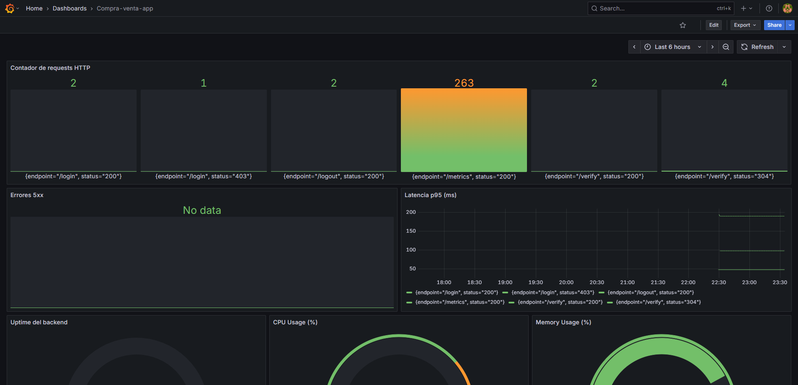
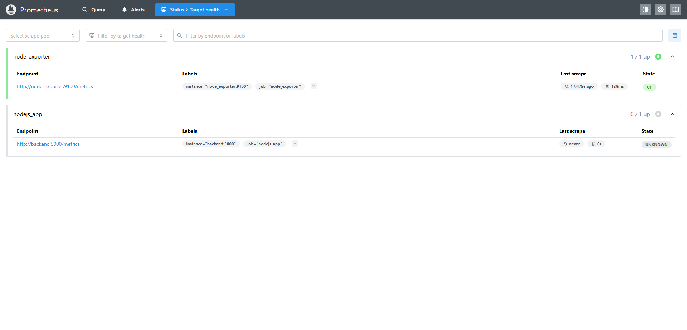
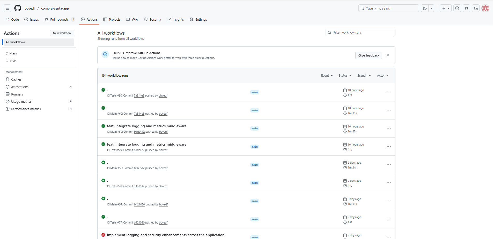

## 📚 Capturas
[Volver al repositorio](https://github.com/bbvedf/compra-venta-app)

<!-- Swiper CSS -->
<link
  rel="stylesheet"
  href="https://cdn.jsdelivr.net/npm/swiper@10/swiper-bundle.min.css"
/>

<!-- Swiper HTML -->

  

    

      

        
      

      
Grafana dashboard

    

    

      

        
      

      
Docker Compose

    

    

      

        
      

      
Prometheus metrics

    

    

      

        
      

      
GitHub Actions

    

    <!-- resto de slides igual... -->
  

  <!-- Navigation -->
  

  

<!-- Thumbnails -->

  

    

    

    

    

    <!-- resto de thumbs igual... -->
  

<!-- Swiper JS -->

