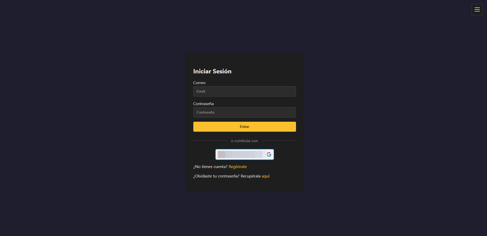

## 📸 Capturas
[Volver al repositorio](https://github.com/bbvedf/compra-venta-app)

<!-- Swiper CSS -->
<link rel="stylesheet" href="https://cdn.jsdelivr.net/npm/swiper@10/swiper-bundle.min.css" />

<!-- Swiper HTML -->

  

    

Grafana dashboard

    

Docker Compose

    

Prometheus metrics

    

GitHub Actions

    

SonarCloud

    

IDE

    

Pantalla login

    

Dashboard básico

    

Login pendiente de aprobación

    

Dashboard admin

    

Gestión de usuarios

    

Calculadora interés compuesto

    

Calculadora amortización

    

Estilo claro

  

  <!-- Navigation -->
  

  

  

<!-- Thumbnails -->

  

    

    

    

    

    

    

    

    

    

    

    

    

    

    

  

<!-- Swiper JS -->

