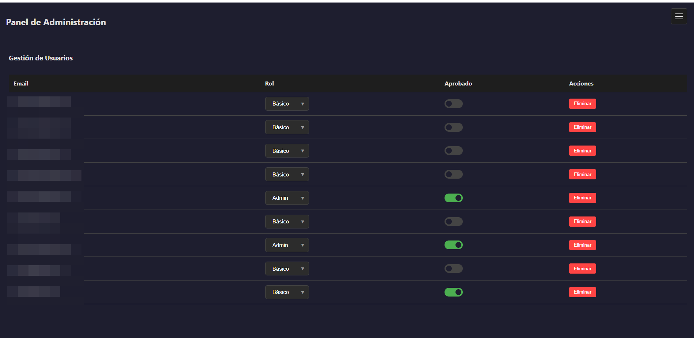

## 📚 Capturas
[Volver al repositorio](https://github.com/bbvedf/compra-venta-app)

  

    

      

        
      

      
Grafana dashboard

    

    

      

        
      

      
Docker Compose

    

    

      

        
      

      
Prometheus metrics

    

    

      

        
      

      
GitHub Actions

    

    

      

        
      

      
SonarCloud

    

    

      

        
      

      
IDE

    

    

      

        
      

      
Pantalla login

    

    

      

        
      

      
Dashboard básico

    

    

      

        
      

      
Login pendiente de aprobación

    

    

      

        
      

      
Dashboard admin

    

    

      

        
      

      
Gestión de usuarios

    

    

      

        
      

      
Calculadora interés compuesto

    

    

      

        
      

      
Calculadora amortización

    

    

      

        
      

      
Estilo claro

    

  

  <!-- Pagination & Navigation -->
  

  

  

