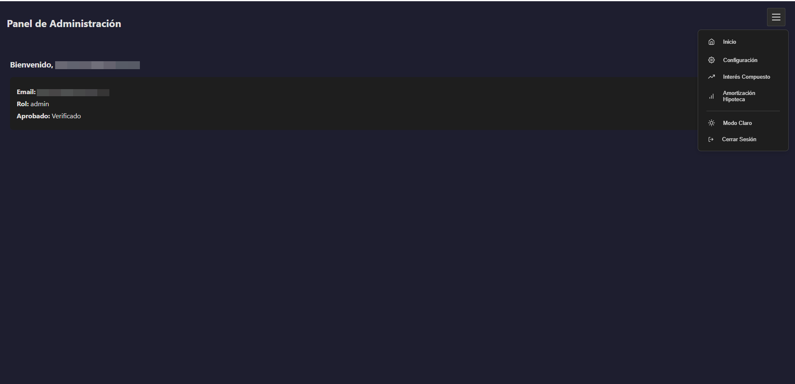

# Compra-Venta App - Capturas

Bienvenido a la galería de capturas de la aplicación.  
Aquí puedes navegar entre todas las vistas principales del sistema.

<!-- Swiper CSS -->
<link
  rel="stylesheet"
  href="https://cdn.jsdelivr.net/npm/swiper@10/swiper-bundle.min.css"
/>

<!-- Swiper HTML -->

  

    

Grafana dashboard

    

Docker Compose

    

Prometheus metrics

    

GitHub Actions

    

SonarCloud

    

IDE

    

Pantalla login

    

Dashboard básico

    

Login pendiente de aprobación

    

Dashboard admin

    

Gestión de usuarios

    

Calculadora interés compuesto

    

Calculadora amortización

    

Estilo claro

  

  <!-- Navigation -->
  

  

<!-- Thumbnails -->

  

    

    

    

    

    

    

    

    

    

    

    

    

    

    

  

<!-- Swiper JS -->

