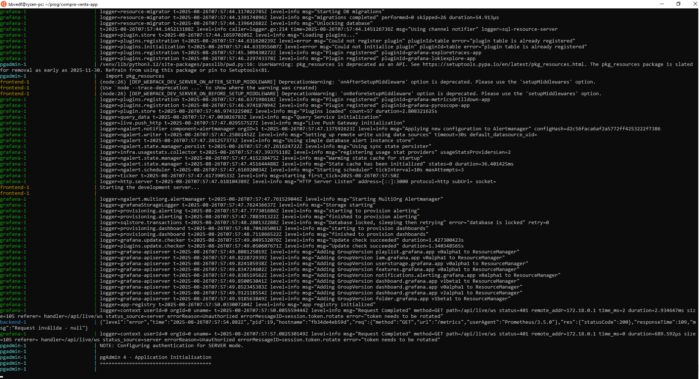
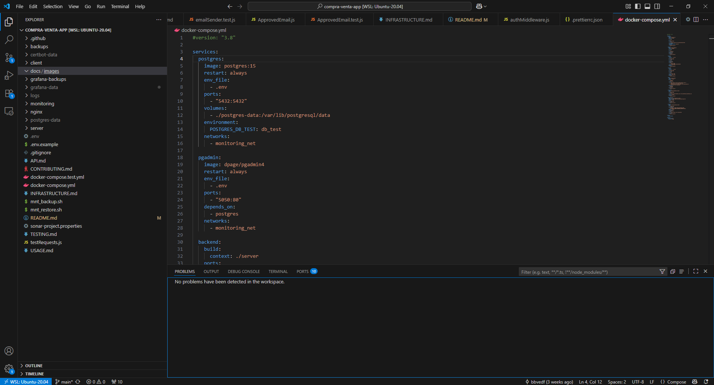

## 📸 Capturas de la aplicación

<figure style="flex: 1 1 300px; text-align: center;">
  
  <figcaption>Dashboard en Grafana</figcaption>
</figure>

<figure style="flex: 1 1 300px; text-align: center;">
  
  <figcaption>Docker Compose en acción</figcaption>
</figure>

<figure style="flex: 1 1 300px; text-align: center;">
  
  <figcaption>Prometheus recogiendo métricas</figcaption>
</figure>

<figure style="flex: 1 1 300px; text-align: center;">
  
  <figcaption>Pipeline de CI en GitHub Actions</figcaption>
</figure>

<figure style="flex: 1 1 300px; text-align: center;">
  
  <figcaption>Análisis de calidad en SonarCloud</figcaption>
</figure>

<figure style="flex: 1 1 300px; text-align: center;">
  
  <figcaption>Vista del proyecto en IDE</figcaption>
</figure>

<figure style="flex: 1 1 300px; text-align: center;">
  
  <figcaption>Pantalla de login</figcaption>
</figure>

<figure style="flex: 1 1 300px; text-align: center;">
  
  <figcaption>Dashboard básico</figcaption>
</figure>

<figure style="flex: 1 1 300px; text-align: center;">
  
  <figcaption>Usuarios pendientes de aprobación</figcaption>
</figure>

<figure style="flex: 1 1 300px; text-align: center;">
  
  <figcaption>Panel de administrador</figcaption>
</figure>

<figure style="flex: 1 1 300px; text-align: center;">
  
  <figcaption>Gestión de usuarios</figcaption>
</figure>

<figure style="flex: 1 1 300px; text-align: center;">
  
  <figcaption>Calculadora de interés compuesto</figcaption>
</figure>

<figure style="flex: 1 1 300px; text-align: center;">
  
  <figcaption>Simulador hipotecario</figcaption>
</figure>

<figure style="flex: 1 1 300px; text-align: center;">
  
  <figcaption>Interfaz en modo claro</figcaption>
</figure>

